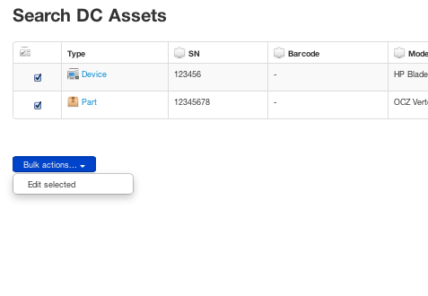
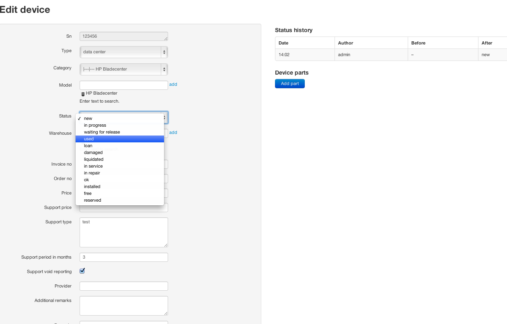

Quickstart
==========

The Ralph Assets module consists of two different use cases -- back office and
data center.  Those two are different because of the field types and data
sources.  Let's start with the data center type.

.. image:: overview.png

Searching and Filtering of Assets
----------------

Let's start with the main screen. Here you find all your hardware assets which are in the database. Use the left column for filtering of the assets. 

There are two types of assets -- devices and parts. A device could be a blade
server, and a part is a component of this server, for example memory or hard
disk drive. A part can be assigned to a single device at a time. You can move
parts from one device to another when you need it.

.. image:: actions.png

You can use the "Actions" menu to trigger actions on the selected device or
part.

Adding Assets
-------------

Now, let's add some devices and parts. Click the "Add device" option from the
top menu.

.. image:: add-devices.png

- Type - a read only field for data center, back office or administration for back office. Administration is used for assets like buildings etc.
- Model - type a couple of letters to search for a given model. If don't find it in the database, just click "Add" button to add it.
- Status - an asset's lifetime indicator. Newly bought assets has status "new". 
  You can change it as required according to your own work flow. 
- Warehouse - the place where the asset is located. 
- Price - the unit price of the asset.
- Support type - you can specify support details here, such as support conditions.
- Provider - the name of the provider of the asset.
- Additional remarks - additional info.
- Request date, Provider order date, Delivery date, Invoice date, Production use date - 
  for now you can choose dates as required. Later it will be integrated with 
  the work flow system.
- Size in units - how large the device is, in "U".

The serial number field is required for assets. You can also optionally enter
the barcodes for them.  You can paste serial numbers and barcodes in series,
thus allowing you to batch-add many devices of the same type. 

Adding Parts
-------------

In the same way you can add parts to the database, and then bind the parts to 
devices. To do this, choose "Add part" from the menu.

.. image:: add-parts.png

- When a part is marked as ``salvaged``, you can enter the old barcode data here.
- On this screen barcodes are not visible, because parts doesn't have barcodes assigned. 

Bulk Editing
-------------

It is often required to edit multiple assets at once. For example, when you
want to move them from one warehouse to another. There is a special mode called
"bulk edit" for this case.

To activate this mode, go to the search screen, and select multiple assets 
using check marks on the left side.

When ready, choose "Edit selected" from the bulk edit actions. 

.. image:: bulk-2.png

On the next screen you can edit those records all at once by changing the
appropriate fields. When you fill one field with the desired value, you can
propagate this value to all records by clicking on the "plus" mark near the
current cell.

Work Flow and Statues
-------------

In this version there are no limits for moving assets from one status to
another.  You can freely change statuses.  All changes will be recorded,
allowing you to inspect the flow later.

Edit Device
-------------

.. image:: edit-device.png

In every case you can edit the asset fields as you like. From this screen you 
can add parts by clicking on the "Add part" button. 

Admin
-----
Administration interface is accessible from within the menu. 

Here you can define

* models,
* categories,
* warehouses,
* other dictionary data.
